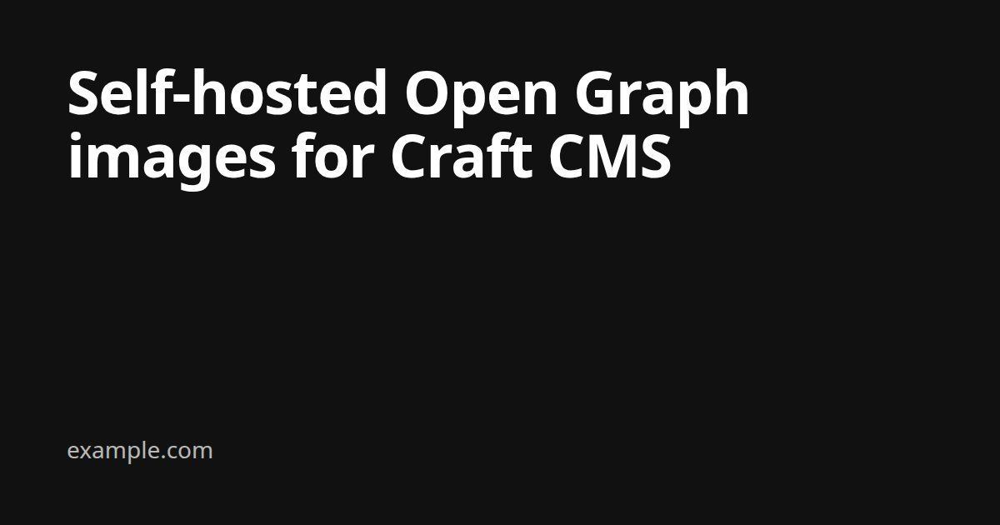

# OG Images for Craft CMS

Open Graph images from ordinary Twig templates, rendered by your own
[Gotenberg](https://gotenberg.dev) instance and stored as assets. Full HTML and CSS
(custom fonts, layout, images), no design logic in PHP, no per-render fees and no
third-party service.



- Craft CMS 5.6+, PHP 8.2+
- Gotenberg 8 (tested with 8.37, the `-chromium` image is enough)
- A queue runner and a volume with public URLs (typically a CDN)

## How it works

1. An entry in a configured section is saved (published saves only: drafts,
   autosaves, revisions, resaves and disabled entries are skipped).
2. A queue job per site renders `templates/_og/{section}.twig` (or `_og/default.twig`)
   to HTML as that site, in that language.
3. If the HTML changed since the last image, the job uploads it to Gotenberg's
   screenshot route and gets back a 1200×630 JPEG.
4. The image is saved as `og-{entryId}-{siteId}-{hash}.jpg` in a dedicated volume,
   then the previous image is deleted. The new filename busts CDN and social caches.
5. `craft.ogImages.url(entry)` (or the SEOmate helper) outputs it.

Gotenberg never calls your site: the HTML is sent to it. Drafts, staging passwords
and unpublished content never need to be reachable from outside.

**Compared to hosted image APIs** (e.g. html2img): same idea, but you run the renderer.
No API key, no plan limits, and your content only goes to your own server.

## Installation

Until the first release is on Packagist, add the repository to your project's `composer.json`:

```json
"repositories": [
    { "type": "vcs", "url": "https://github.com/larsmarkus-studio/craft-og-images.git" }
]
```

```bash
composer require larsmarkus-studio/craft-og-images:dev-master
php craft plugin/install lms-og-images
```

## Gotenberg

[`examples/docker-compose.gotenberg.yml`](examples/docker-compose.gotenberg.yml) is a
ready-to-deploy service (basic auth, Chromium allow-list, unused routes disabled,
memory limit, health check). Put it behind a TLS-terminating reverse proxy and set:

| Variable | |
|---|---|
| `GOTENBERG_USER`, `GOTENBERG_PASSWORD` | Basic auth, the same values as in your Craft `.env` |
| `CHROMIUM_ALLOW_LIST` | What Chromium may load: the uploaded page plus the host(s) your templates load images from |

```
CHROMIUM_ALLOW_LIST=^file:///tmp/,^https://cdn\.example\.com[:/]
```

- One regex per host, comma-separated. Gotenberg checks HTTPS per host (it sees
  `https://host:443`, not the path), so match the host followed by `[:/]`. A pattern
  like `^https://cdn\.example\.com/.*` blocks everything.
- No `$` in the value; Compose may interpolate it.
- Adding a site that loads images from another host means adding an entry and redeploying.

For local development, add `ports: ["3000:3000"]` and run `docker compose -f examples/docker-compose.gotenberg.yml up`.

## Storage

The plugin writes into a volume you create; it never creates filesystems or volumes.

- **Use a dedicated volume** (e.g. handle `ogImages`) on your existing CDN filesystem,
  with public URLs and no transforms. Keep it away from editors via volume permissions.
  Nothing else should live in it: `sweep` treats the volume root as its own.
- **Give every environment its own path**, via the volume's subpath and an env var
  (e.g. `$OG_SUBPATH` = `opengraph` in production, `opengraph-staging`, `opengraph-dev`).
  Staging and local usually run on copies of the production database, so entry IDs
  match: with a shared path, a staging render would delete production's image.
- Files live flat in the volume root; the filename holds type, entry, site and hash.

## Configuration

`config/lms-og-images.php` (multi-environment arrays work):

```php
<?php

return [
    'sections' => ['pages', 'news'],
    'volume' => 'ogImages',
    'assetFiles' => ['@webroot/assets/fonts/inter-bold.woff2'],
];
```

| Setting | Default | |
|---|---|---|
| `gotenbergUrl` | `$GOTENBERG_URL` | Gotenberg base URL |
| `gotenbergUser` | `$GOTENBERG_USER` | Basic auth user |
| `gotenbergPassword` | `$GOTENBERG_PASSWORD` | Basic auth password (never logged) |
| `sections` | `[]` | Section handles that get OG images |
| `onlyWithUrl` | `true` | Only entries that have a URL get an image (a section can mix entries with and without a page) |
| `volume` | `null` | Handle of the dedicated OG volume |
| `templateRoot` | `'_og'` | Templates are `{templateRoot}/{sectionHandle}`, falling back to `{templateRoot}/default` |
| `assetFiles` | `templates/{templateRoot}/assets/*` | Files sent along with the page, referenced by filename. Aliases and wildcards work |
| `width`, `height` | `1200`, `630` | Image size |
| `format` | `'jpeg'` | `jpeg` or `png`. JPEG is the safe choice for link-preview crawlers |
| `quality` | `85` | JPEG quality |
| `fallbackUrl` | `null` | Image URL for entries without one yet; a string or an array keyed by site handle |

`.env`:

```
GOTENBERG_URL=https://render.example.com
GOTENBERG_USER=…
GOTENBERG_PASSWORD=…
OG_SUBPATH=opengraph-dev
```

### Queue

Images are only rendered in queue jobs and console commands, never during a page
request. Run a real worker in production and turn off the web-request runner:

```php
// config/general.php
'runQueueAutomatically' => false,
```

```bash
php craft queue/listen
```

Jobs retry up to 3 times, take a lock per entry and site, and skip rendering when
the HTML hasn't changed. Failures are logged under the `lms-og-images` category.

## Templates

`templates/_og/default.twig`, and optionally one per section (`_og/news.twig`).
The page is rendered in a 1200×630 viewport and receives `entry` and `site`.

```twig
<!doctype html>
<html lang="{{ site.language }}">
<head>
  <meta charset="utf-8">
  <style>
    @font-face { font-family: brand; src: url('inter-bold.woff2') format('woff2'); }
    * { box-sizing: border-box; margin: 0; }
    html, body { width: 1200px; height: 630px; overflow: hidden; }
    body { display: flex; align-items: flex-end; padding: 72px; background: #111; color: #fff; }
    h1 { font-family: brand, sans-serif; font-size: 80px; line-height: 1; }
  </style>
</head>
<body>
  
  
    
  
  <h1>{{ entry.title }}</h1>
</body>
</html>
```

- **Fonts and local files**: list them in `assetFiles` and reference them by filename,
  as if they sat next to the page. They're uploaded with every render.
- **Remote images** need an absolute URL on a host in Gotenberg's allow-list.
- **Transforms**: pass `true` as the second argument to `getUrl()` so the transform
  exists right away; Gotenberg can't call Craft's on-demand transform URL.
- **No ready script needed**: the plugin waits for web fonts and `` elements to load.
- **Failures are loud**: an image or font that fails to load (missing file, host not
  on the allow-list) fails the job with the exact URL instead of rendering a gap.
- Templates render from the console, so use absolute site URLs and don't rely on
  `craft.app.request`.
- Extending a base template with blocks (``) works as usual.

### Preview while editing

Add a preview target to each section (Settings → Sections → Preview Targets):

| Label | URL Format |
|---|---|
| OG image | `og-preview/{canonicalId}/{siteId}` |

It renders the template with the unsaved changes, scaled to the preview pane, without
calling Gotenberg, so it updates as you type. Add `&render=1` to the preview URL for
the real image. The route only answers requests with a valid Craft preview token.

## Output

```twig
{{ craft.ogImages.tags(entry) }}
```

outputs `og:image`, `og:image:width`, `og:image:height` and `twitter:image`. Also available:

| | |
|---|---|
| `craft.ogImages.url(entry)` | Image URL, or the fallback, or `null` |
| `craft.ogImages.asset(entry)` | The Asset, or `null` |

Lookups are memoized per request and never throw: a misconfiguration is logged and the
page renders without the image.

### SEOmate

Use this instead of `tags()`, in the layout right before SEOmate's hook:

```twig


```

SEOmate only accepts an Asset for `og:image` and would transform it into a second,
re-encoded copy; a plain URL comes out empty. The helper passes the URL (with width,
height and type) and turns off SEOmate's `og:image` transform for that page only.
Pages without a generated image keep SEOmate's own image settings. The job also clears
SEOmate's meta cache for the entry after each new image.

### Caches

Saving and deleting the image assets invalidates Craft's template caches, and
full-page caches that track element usage (e.g. Blitz) refresh the pages that showed
the old image. No extra setup.

## Console commands

```bash
php craft lms-og-images/test 123 [--site=handle] [--html]
```
Renders one entry synchronously without saving: template, hash, current image, size and
timing. `--html` prints the rendered page instead of calling Gotenberg. Use it to check a setup.

```bash
php craft lms-og-images/backfill [--section=handle] [--site=handle] [--limit=100] [--force]
```
Queues jobs for existing entries. Without `--force` only entries without an image.
With `--force` all of them; unchanged images are still skipped, so after a template
change only the ones that look different are rendered.

```bash
php craft lms-og-images/sweep [--dry-run]
```
Deletes images whose entry is gone or no longer in a configured section, and older
versions. Only looks at the volume root and only at files named like OG images; an
image referenced from a relation field is never deleted. Run it from cron.

## Troubleshooting

| Symptom | Cause |
|---|---|
| `Gotenberg rejected the credentials (401)` | `GOTENBERG_USER` / `GOTENBERG_PASSWORD` don't match the server |
| `Gotenberg timed out (503)` | The page took longer than Gotenberg's `--api-timeout` (30s in the example); usually a slow or unreachable remote image |
| `These failed to load: https://…` | Wrong URL, or the host isn't in `CHROMIUM_ALLOW_LIST` (Gotenberg blocks it silently otherwise) |
| `font <name>` in the error | The font URL in `@font-face` doesn't match a file in `assetFiles`, or a remote font host sends no CORS header |
| `No OG template found` | Create `templates/_og/default.twig` (or change `templateRoot`) |
| `OG volume '…' not found` / `has no public URLs` | Check `volume` and the volume's URL settings |
| Image doesn't change after an edit | The rendered HTML is identical (the hash matches), or the queue isn't running. `lms-og-images/test` shows both hashes |
| Social platform shows an old image | Platforms cache previews per page URL; re-scrape with their debug tools. The image URL itself always changes |

## Roadmap

Not planned for 1.0: CP settings page, per-entry overrides, other image sizes
(the filename already carries the type), template gallery, other renderers.

## Maintenance

Built for my own client sites and maintained on a best-effort basis. Issues and pull
requests are welcome.

## License

MIT
